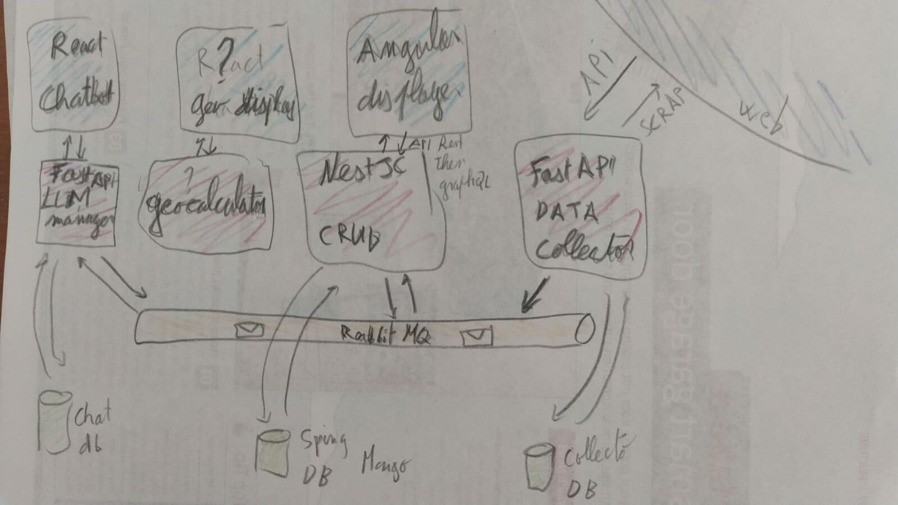

# back_world_wide_spring

<p align="center">
  <a href="http://nestjs.com/" target="blank"></a>
</p>

[circleci-image]: https://img.shields.io/circleci/build/github/nestjs/nest/master?token=abc123def456
[circleci-url]: https://circleci.com/gh/nestjs/nest

  <p align="center">A progressive <a href="http://nodejs.org" target="_blank">Node.js</a> framework for building efficient and scalable server-side applications.</p>
    <p align="center">
<a href="https://www.npmjs.com/~nestjscore" target="_blank"></a>
<a href="https://www.npmjs.com/~nestjscore" target="_blank"></a>
<a href="https://www.npmjs.com/~nestjscore" target="_blank"></a>
<a href="https://circleci.com/gh/nestjs/nest" target="_blank"></a>
<a href="https://coveralls.io/github/nestjs/nest?branch=master" target="_blank"></a>
<a href="https://discord.gg/G7Qnnhy" target="_blank"></a>
<a href="https://opencollective.com/nest#backer" target="_blank"></a>
<a href="https://opencollective.com/nest#sponsor" target="_blank"></a>
  <a href="https://paypal.me/kamilmysliwiec" target="_blank"></a>
    <a href="https://opencollective.com/nest#sponsor"  target="_blank"></a>
  <a href="https://twitter.com/nestframework" target="_blank"></a>
</p>
  <!--[](https://opencollective.com/nest#backer)
  [](https://opencollective.com/nest#sponsor)-->

## Description

[Nest](https://github.com/nestjs/nest) framework TypeScript starter repository.

This is a CRUD ta manage Mongo Database with a future world wide data from spring water. This will collect data like name brand name, composition, location, geology ...
This repository is a microservice. Other microservice will be provided. 
The ambition of this project is to create miriade of microservices to deal with collecting (API request and scrapping), provide, show and illustrate data related to spring arround the world. 
Back end microservices will be: 
+ RestAPI CRUD on MongoDB with a NestJS API. 
  + This CRUD will later provide a GraphQL endpoint
+ FastAPI collector. This microservice collect data from external API and from scrapping
+ A microservice to deal with geographic data. 
+ A FastAPI microservices to manage LLM model and chatbot abble to respond to question about our data (the architecture for this part will be derterminate in the future). 
Front End services: 
+ Angular front end will display spring store in database. 
+ In a long term futur a React front will provide a chatbot powered with LLM. 
The goal of this project is not to proide services about spring water, it is a side project design to play with many technology and illustrate my skills.

<p align="center">
  
</p>

The aim is also to play with docker, kubernetes and all toy avaible for happy developer. 

## Installation

```bash
$ yarn install
```

## Running the app

```bash
# development
$ yarn run start

# watch mode
$ yarn run start:dev

# production mode
$ yarn run start:prod
```

## Test

```bash
# unit tests
$ yarn run test

# e2e tests
$ yarn run test:e2e

# test coverage
$ yarn run test:cov
```
## Command

```bash
$ npx nestjs-command create:spring
```
## Support

Nest is an MIT-licensed open source project. It can grow thanks to the sponsors and support by the amazing backers. If you'd like to join them, please [read more here](https://docs.nestjs.com/support).

## Stay in touch

- Author - [Kamil Myśliwiec](https://kamilmysliwiec.com)
- Website - [https://nestjs.com](https://nestjs.com/)
- Twitter - [@nestframework](https://twitter.com/nestframework)

## License

Nest is [MIT licensed](LICENSE).
